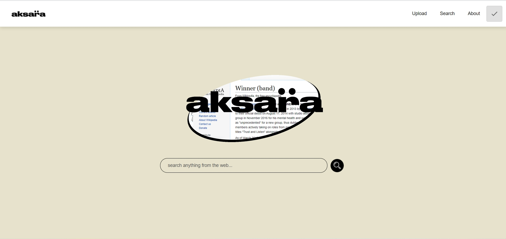

# Algeo02-19079
# Project Name
> Here goes your awesome project description!

## Table of contents
* [General info](#general-info)
* [Screenshots](#screenshots)
* [Technologies](#technologies)
* [Setup](#setup)
* [Features](#features)
* [Status](#status)
* [Inspiration](#inspiration)
* [Contact](#contact)

## General info
Add more general information about project. What the purpose of the project is? Motivation?

## Screenshots

## Technologies
* Tech 1 - version 1.0
* Tech 2 - version 2.0
* Tech 3 - version 3.0

## Setup
- open folder pada vscode
- buka terminal pada vscode
  lalu ketik kode berikut
   - cd src
   - cd frontend
   - yarn 
   - yarn start
 - buka terminal untuk backend
   - cd src
   - cd backend 
   - install pipenv terlebih dahulu jika belum ada
   - pip install pipenv
   - pipenv shell
   - python app.py
   
## Code Examples
Show examples of usage:
`put-your-code-here`

## Features
List of features ready and TODOs for future development
* Awesome feature 1
* Awesome feature 2
* Awesome feature 3

## Status
Project is: finished.

## Inspiration
Add here credits. Project inspired by..., based on...

## Contact
Created by [@flynerdpl](https://www.flynerd.pl/) - feel free to contact me!
