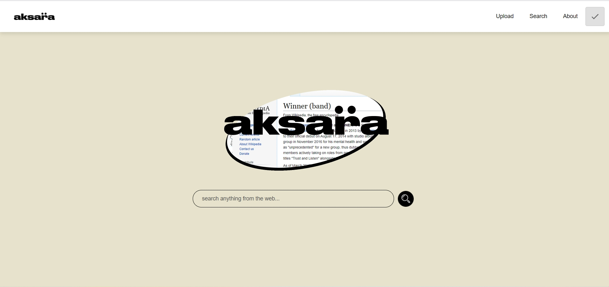

# Algeo02-19079
# Project Name
> Aksara

## Table of contents
* [General info](#general-info)
* [Screenshots](#screenshots)
* [Technologies](#technologies)
* [Setup](#setup)
* [Features](#features)
* [Status](#status)
* [Contact](#contact)

## General info
Project ini merupakan tugas besar Algeo ITB ke 2. Project ini dibuat dengan menggunakan framework React.js dan API dengan Axios serta Flask. 
Tujuan dari project ini adalah untuk membuat Search Engine sederhana yang dapat menerima inputtan file dan melakukan Search query berdasarkan dokumen yang dimasukkan.

## Screenshots

## Technologies
* Flask - version 1.1.2
* React.js - version 7.10.4
* Axios
* Beautifulsoup - version 4.9.3
* NLTK - version 3.5
* regex - version 2020.11.13

## Setup
- clone repository ini
- open folder yang sudah diclone pada vscode
- buka terminal pada vscode
  lalu ketik kode berikut
  
  Untuk setup frontend
   - cd src
   - cd frontend
   - install yarn terlebih dahulu jika belum ada
   - yarn install
   - yarn start
   
  Untuk setup backend
   - cd src
   - cd backend 
   - install pipenv terlebih dahulu jika belum ada
   - pip install pipenv
   - pipenv shell
   - python app.py
   
   
## Important
- 15 file .html sudah ada di folder ../src/backend/static , pada folder testing hanya disediakan 3 file .html
- Website https://www.worldoftales.com/ yang digunakan untuk webscraping terkadang mengalami down, silakan cek status web di https://www.isitdownrightnow.com/

## Features
List of features ready and TODOs for future development :
* Multiple-upload file with drag and drop or onclick features
* Normal mode and Webscrap mode features 
* Search query from documents features

## Status
Project is: finished.

## Contact
Created by 
- Jesson Gossal Yo (13519079)
- Marcello Faria (13519086)
- Hera Shafira (13519131)
